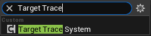
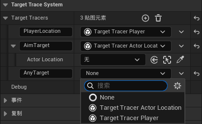
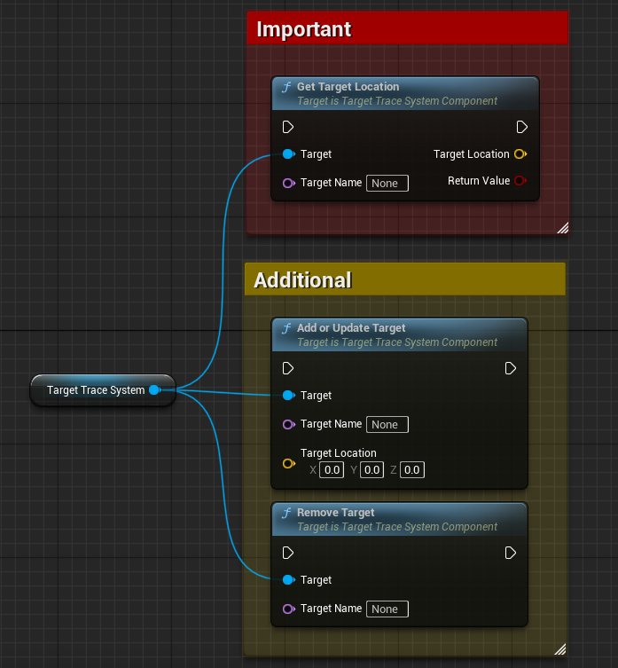
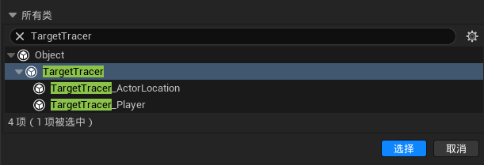
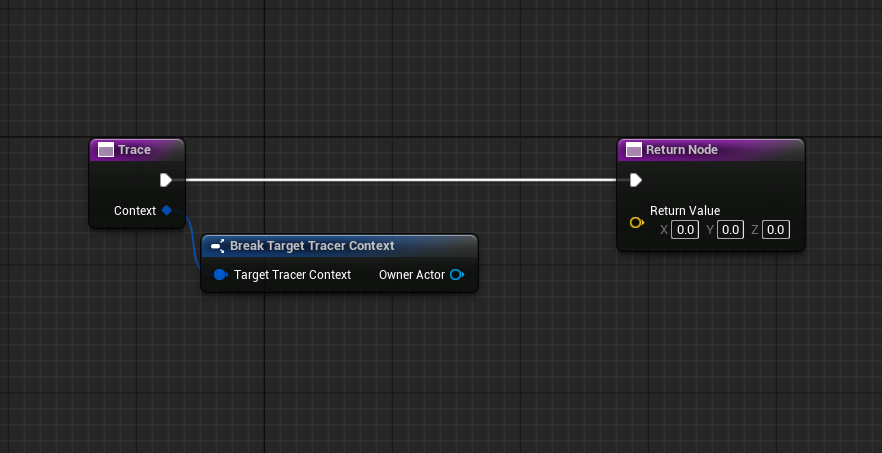
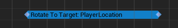

# TargetTraceSystem
> Language: [English](README.md), [中文](README-CN.md)

A versatile target tracking system that allows developers to centrally manage various target tracking requirements, especially suitable for enemy AI systems.

## Features
- Event-driven, performance-friendly
- Modular design, easy to extend
- Supports custom tracers to meet specific needs

## Usage
1. Add the `TargetTraceSystem` component to your Actor.

    

2. Configure the `Target Tracers` dictionary, where the key is the name of the tracer, and the value is the tracer instance.

    

3. Call the relevant methods of `TargetTraceSystem` wherever target tracking is needed.

    

    - `Get Target Location`: Retrieves the tracking result of the specified tracer by name.
    - `Add or Update Target` and `Remove Target`: Used to temporarily add or remove targets in the tracking system, typically for dynamic tracking needs. In most cases, these methods are unnecessary; it is recommended to use custom tracers instead.

    Each time you call `Get Target Location`, the system will locate the corresponding tracer and execute its tracking function. If you need custom tracking logic, you can implement it in a custom tracer. The process is simple: first, create a subclass of `TargetTracer`:

    

    Then override the `Trace` method, and the returned result will be the target's location:

    

4. Freely extend the system's usage. For example, you can use it in an AnimNotifyState to get the player's current position and use it to create tracking effects for enemy attacks. Feel free to implement additional use cases based on your needs, and we welcome everyone to share their unique applications.

    

## About Pull Requests
If you have any suggestions or ideas for improving this system, feel free to submit a pull request (PR)! We highly welcome and appreciate community participation and contributions.
Please ensure your PR adheres to the following guidelines:
1. The PR should include a clear description explaining the changes you made and their purpose.
2. The PR should follow the code style and conventions to maintain consistency and readability.
3. The PR should include necessary documentation updates to help others understand your changes.

## License
This project is licensed under the MIT License. For details, please refer to the [LICENSE](LICENSE) file.